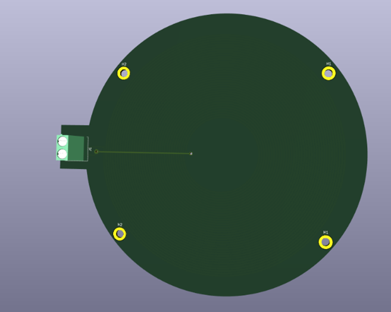
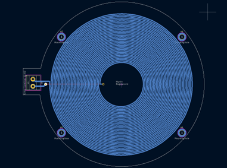
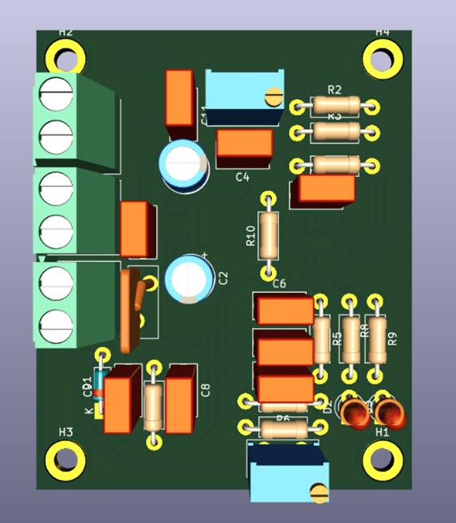
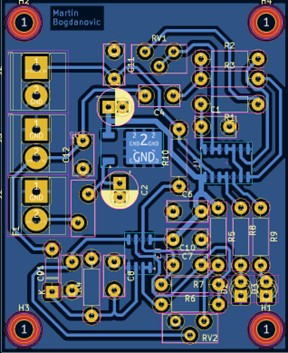

# metal-detector-arduino

Metal detector project using Arduino, analog circuits, and a Windows Forms GUI to measure object dimensions on a conveyor belt.

---

## **Project Overview**

This project implements a **metal detection system** for conveyor belts using a combination of **analog electronics** and **software**. The system detects metal objects and calculates their **length, width, and conveyor speed**, presenting the data in a **user-friendly GUI**.

Detection is based on a **resonant LC circuit**. A coil generates an electromagnetic field, and nearby metal objects disturb this field, changing the resonance frequency. The resulting signal is processed through a **Schmitt trigger buffer** and an **operational amplifier**. An **Arduino** reads the processed signal, performs real-time calculations, and sends the measurements to a PC for display.

---

## **Key Features**

- **Analog detection:** Resonant LC circuit with coil for precise metal detection  
- **Signal processing:** Schmitt trigger buffer and inverting operational amplifier for clean, noise-free digital signals  
- **Arduino software:** Calculates object length, width, and conveyor speed  
- **GUI display:** Windows Forms application shows measurements in real-time  
- **Serial communication:** Arduino transmits data to the PC using a simple protocol  

---

## **System Components**

- **Oscillator:** Generates AC signal for LC resonance  
- **Schmitt trigger buffer:** Ensures rapid voltage transitions and noise immunity  
- **Voltage regulator (LM78M05):** Provides stable 5V power to the circuit  
- **Resonance tank (LC circuit):** Detects changes in metal proximity  
- **Inverting operational amplifier:** Amplifies small signal changes for accurate detection  

---

## **PCB**

## **PCB and Circuit Images**

### PCB Prototype
  

### Assembled Metal Detector Board
  

### GUI Display Screenshot
  

### Project Overview Photo
  

---

## **Software**

- **Arduino:** Reads sensor data, calculates object measurements, and communicates with the PC  
- **Windows Forms GUI:** Displays object length, width category, and conveyor speed in real-time  

---

## **Conclusion**

The system successfully detects metal objects on a conveyor belt and measures their dimensions accurately. This project demonstrates a **practical integration of analog electronics, microcontroller programming, and GUI software** in a first-year engineering project.

---
